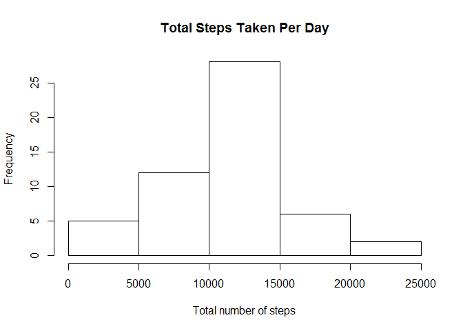
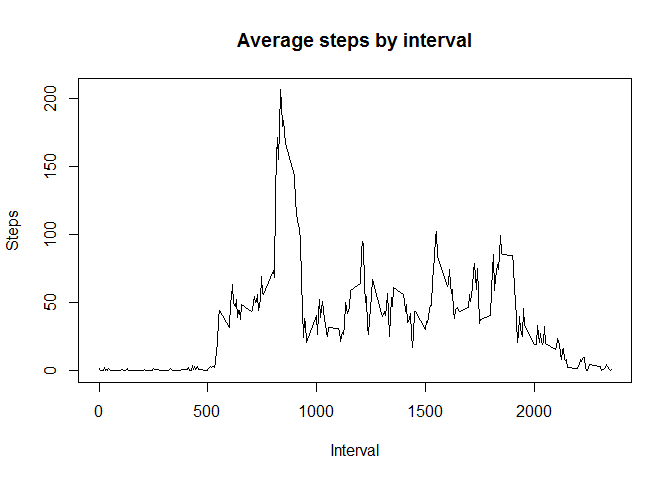
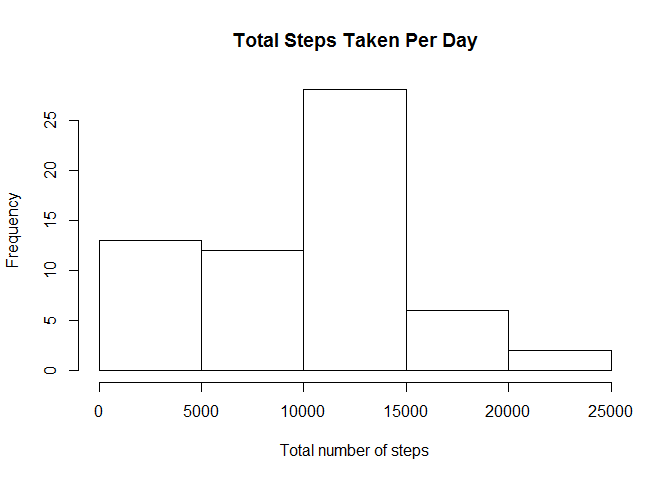
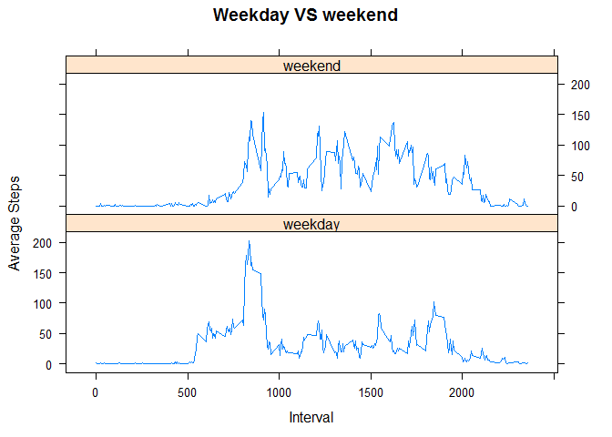

# Reproducible Research: Peer Assessment 1
Ng Shu Min  

Setting up options for r code output:


```r
#Set up the options for R code
options(scipen=5, digits=2)
```
## Loading and preprocessing the data
First step is to unzip and read the csv file from the working directory:


```r
# Create a temp file and unzip the data file
temp<-tempfile()
temp<-unzip("activity.zip")   #unzip the file from current working directory

# Read the csv file 
data<-read.csv(temp)
unlink(temp)
```

Examine the data to check that it was read correctly:


```r
# Display summary of the data
summary(data)
```

```
##      steps              date          interval   
##  Min.   :  0    2012-10-01:  288   Min.   :   0  
##  1st Qu.:  0    2012-10-02:  288   1st Qu.: 589  
##  Median :  0    2012-10-03:  288   Median :1178  
##  Mean   : 37    2012-10-04:  288   Mean   :1178  
##  3rd Qu.: 12    2012-10-05:  288   3rd Qu.:1766  
##  Max.   :806    2012-10-06:  288   Max.   :2355  
##  NA's   :2304   (Other)   :15840
```

```r
# Check the first few values
head(data)
```

```
##   steps       date interval
## 1    NA 2012-10-01        0
## 2    NA 2012-10-01        5
## 3    NA 2012-10-01       10
## 4    NA 2012-10-01       15
## 5    NA 2012-10-01       20
## 6    NA 2012-10-01       25
```

Use dplyr package to manipulate the data:


```r
library(dplyr)
```

```
## 
## Attaching package: 'dplyr'
## 
## The following object is masked from 'package:stats':
## 
##     filter
## 
## The following objects are masked from 'package:base':
## 
##     intersect, setdiff, setequal, union
```

```r
stepsData<-tbl_df(data)
```
## What is mean total number of steps taken per day?

Using dplyr, first get the data on the total number of steps per day


```r
#Obtain a table of total steps per day based group by date 
dailySteps <- stepsData %>% filter(!is.na(steps))  %>% group_by(date) %>% summarise(total=sum(steps))
```

Now make a histogram of the daily steps taken per day:


```r
# Calculate frequency of daily steps
hist(dailySteps$total, xlab="Total number of steps", main= "Total Steps Taken Per Day")
```

 


```r
#Calculate the mean daily steps
meanSteps<-mean(dailySteps$total)

#Calculate the median daily steps
medSteps<-median(dailySteps$total)
```

The mean total number of steps per day is **10766.19**.
The median total number of steps per day is **10765**.

## What is the average daily activity pattern?

First we will create a table of the average number of steps per 5 minute interval over all the days:


```r
#Obtain the table of mean steps per time interval
hourlySteps <- stepsData %>% filter(!is.na(steps))  %>% group_by(interval) %>% summarise(avg=mean(steps))
```

The average daily activity pattern is shown in the graph below:


```r
# plot the time series for the average steps per time interval
plot(hourlySteps$interval, hourlySteps$avg, type="l", main="Average steps by interval", xlab="Interval", ylab="Steps")
```

 

## Maximum number of steps

To find the interval which contains the maximum number of steps:

```r
#The interval with the highest average steps
maxInterval <- hourlySteps$interval[which.max(hourlySteps$avg)]
```

The interval with the highest average number of steps is **835**.

## Imputing missing values


```r
#Calculate how many NA values
numNA<-sum(is.na(data$steps))
```

There are **2304** rows with NA for the number of steps.
These values will be replaced with the median for the 5-minute interval for the other days.


```r
#First create second data set
data2<-stepsData
# Now replace NA values in second data set with median of the values in the same 5-minute interval
 data2$steps[is.na(data2$steps)]=median(filter(stepsData, stepsData$interval==data2$interval)$steps, na.rm=TRUE)
```

A histogram of this new data set looks quite different from the original:


```r
# Summarize the total daily steps
dailyStepsNoNA <- data2 %>% filter(!is.na(steps))  %>% group_by(date) %>% summarise(total=sum(steps))

#Draw the frequency histogram
hist(dailyStepsNoNA$total, xlab="Total number of steps", main= "Total Steps Taken Per Day")
```

 

Now calculate the new mean and median:


```r
#Calculating Mean for Data set with missing values filled
meanNoNA<-mean(dailyStepsNoNA$total)

#Calculating Median for Data set with missing values filled
medNoNA<-median(dailyStepsNoNA$total)
```

Value Calculated| With NA values | NA values replaced with median for the time interval
----------------| ---------------| -----------------
Mean total steps per day  | 10766.19 | 9354.23
Median total steps per day | 10765 | 10395

When replaced by the median for the respective time intervals, both the median and the mean values are **lower**. 

## Are there differences in activity patterns between weekdays and weekends?

First add a factor to determine if the data is for weekday or weekend:


```r
# Use weekdays() function to determine day of week and add new column
data2$dow<-weekdays(as.Date(data2$date))

weekdays<-c("Monday","Tuesday", "Wednesday", "Thursday", "Friday")

# Creating a new factor variable to represent weekday or weekend

data2$dayType<-"weekend"
# if monday to friday, replace dayType as "weekday"
data2$dayType[data2$dow %in% weekdays]<-"weekday"
```

To create the panel plot, use the Lattice system:


```r
intSteps <- data2 %>% group_by(dayType, interval) %>% summarise(avg=mean(steps))
library(lattice)
xyplot(intSteps$avg ~ intSteps$interval | intSteps$dayType, type="l", layout=c(1,2), main="Weekday VS weekend", xlab="Interval", ylab="Average Steps")
```

 
